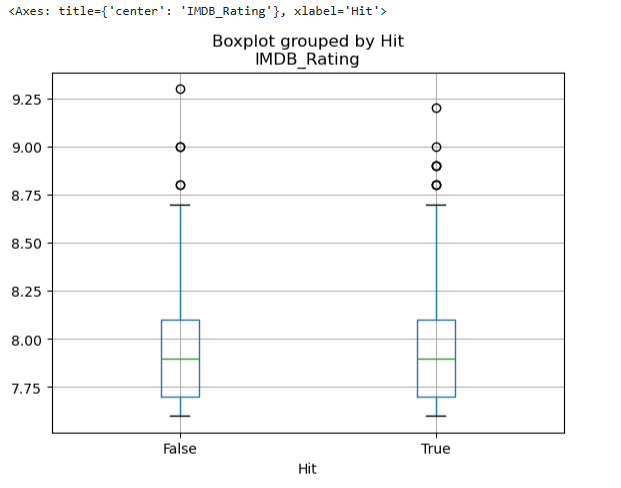
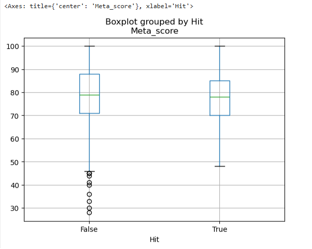
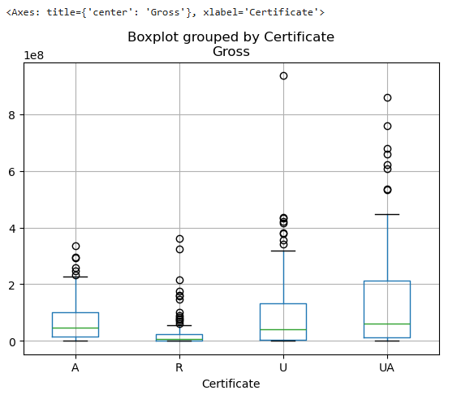

# 영화 데이터 실습

## 분석 개요
본 챕에서는 kaggle에서 제공하는 영화 데이터를 활용해
영화의 평점과 관람등급이 흥행에 어떤 영향을 미치는지 살펴보았다.
특히 IMDB_Rating(대중 평점), Meta_score(평론가 평점)과 흥행 여부 관계
그리고 관람등급에 따른 수익 차이를 중심으로 분석을 진행했다.

## 데이터 탐색 (EDA)
데이터를 분석하기 전에 데이터를 이해하고 구조를 파악하는 중요한 과정이다.
데이터의 구조를 이해하고, 데이터의 품질을 확인하여 패턴 및 관계를 탐색하는 작업을 거친다.
EDA를 소홀히하면 데이터의 특성을 제대로 이해하지 못해
분석이 왜곡되거나 잘못된 결론을 도출할 수 있다.

이 분석에서는 데이터 기본 통계 정보, 변수 간 관계 등을 확인하였다.

## 흥행 기준 정의
영화의 흥행 여부를 판단하기 위해
영화의 박스오피스 수익(Gross)의 3사분위수 이상에 해당하는 영화를
흥행 영화(Hit)라고 정의하였다.

## 영화 관람 기준
- U : 모든 연령 관람 가능
- UA : 보호자 동반 시 관람 가능
- R : 17세 미만 보호자 동반 시 관람 가능
- A : 성인

이 분석에서 사용한 4개의 등급만을 포함하였다. 

## 분석 결과

### 1. 평점과 흥행 여부의 관계
분석 전 평점이 높은 영화일수록
영화의 수익이 높아지고 흥행한 영화일 것이라고 생각했다.

흥행 여부에 따른 평점 분포를 비교한 결과,
흥행 영화가 비흥행 영화보다
IMDB 평점이나 Meta 평점이 뚜렷하게 높다고 보기는 어려웠다.

이는 영화의 흥행이 평점 외에도
마케팅, 개봉 시기, 배우 인지도 등
다양한 외적 요인의 영향을 받기 때문으로 해석할 수 있다.

### 2. 관람 등급에 따른 수익 차이
분석 전 관람 연령대가 다양할수록
관람객 수가 많아져 영화의 수익도 높아질 것이라고 생각했다.

관람등급별 수익을 비교한 결과,
U와 UA 등급 영화는 평균 수익과 상위 수익 모두에서
상대적으로 높은 성과를 보였다.

반면, A와 R 등급 영화는
관객층이 제한되어 평균 수익이 낮은 편이었으며,
일부 예외적인 흥행 사례를 제외하면
전반적인 수익 규모는 크지 않았다.

## 한계 및 느낀 점
이 분석에서는 여러 변수를 함께 고려하지 않았기 때문에
하나의 변수만을 보고 영화 흥행에 영향을 설명하기에는 한계가 있었다.
향후에 장르, 제작비, 개봉 시기 등의 요소를 함께 고려한다면
보다 풍부한 분석이 가능할 것으로 보인다.

## 한 줄 요약
평점을 단독으로 사용하여 영화의 흥행을 설명하긴 어려웠고
관람 연령대가 다양해질수록 영화의 수익률이 높아져 영화의 흥행 잠재력이 커지는 것을 볼 수 있었다.
